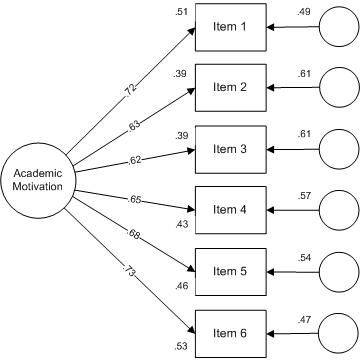

### Introduction 

This document is one of a series designed to illustrate how the R statistical computing environment can be used to conduct various types of social work research. In this report, we present an example of using R to conduct a confirmatory factor analysis (CFA) of the Academic Motivation Scale (AMS) included in a compendium of scales designed for use by school social workers. The Community and Youth Collaborative Institute School Experience Surveys http://cayci.osu.edu/surveys/) resource makes available various scales designed for elementary, middle, and high school students, teachers and staff, and parents and caregivers. The scales are marketed as valid and reliable measures of constructs that are important for needs assessments, program planning, and program evaluations in school settings.

For this analysis, we use the R *lavaan* package to fit and assess a confirmatory factor analysis of the AMS. The scale items are as follows:

  1. I have a positive attitude toward school
  2. I feel I have made the most of my school experiences so far
  3. I like the challenges of learning new things in school
  4. I am confident in my ability to manage my school work
  5. I feel my school experience is preparing me well for adulthood
  6. I have enjoyed my school experience so far
  
The response categories are *Strongly disagree*, *Disagree*, *Can't decide*, *Agree*, and *Strongly agree*.
  
The CFA process is composed of the following steps and decisions:

1. Construct a path diagram that shows the measurement model of interest
2. Identify the level of measurement for each item. Most social work scales are composed of items that are measured at an ordinal level of measurement (e.g., using Likert type repsonse scales)
3. Ensure that the fitting function you chose is based on measurement types (e.g., maximum likelihood for continuous measures, weighted least square for ordinal measures)
4. Move through the model testing process in a logical fashion
  - Fit the model using the appropriate fitting function and carefully assess model fit using a set of popular indexes
  - Once you have established a plausible model, interpret various item level parameters (e.g., loadings, standard errors, R-squared values, error terms, etc.)
5. Tell the world...

We follow these steps in this document.

#### CFA model

It is helpful to present a model of interest using a path diagram. For example, the path diagram for the AMS is shown below. In this diagram, item responses are influenced by two sources --- the academic motivation construct and an error term. The basic assumption implied by this model is that responses to items share the common influence of academic motivation and, also, are influenced by other, non-academic motivation influences that are unique to that item. In the language of CFA, this is a one-factor, first order factor model in which all six items directly measure academic motivation.

 

### Analysis

The R *lavaan* package includes a versatile set of tools and procedures to conduct a CFA (in fact, it is designed to do structural equation modeling which we illustrate in another presentation). The package was designed to provide applied researchers, teachers, and statisticians a free, fully open-source, but commercial quality package for latent variable modeling. It rivals MPLus, EQS, Lisrel, and Amos in terms of features and capacities --- and it is free. 

We load *lavaan* and other helpful packages as follows:

```{r setup, include=FALSE}
knitr::opts_chunk$set(echo = TRUE)
```

```{r message=FALSE, warning=FALSE}
##Load Libraries
library(lavaan)
library(dplyr) 
library(tidyr)
library(knitr)
library(MVN)
```

The data used in this study came from 3,221 seventh grade students in seventeen school districts in a large mid-western urban county. We load the data file with these commands: 

```{r message=FALSE, warning=FALSE}
##Load Data
data <- read.csv("motivation.csv", header=TRUE)  ## load a comma separated values (.csv) file
head(data, 3)                                    ## list a first few records to check your data set
```

The *lavaan* CFA syntax is straightforward. First, we define our model then specify that model in the cfa function. There are two notable components in the cfa specification. We indicate that our variables are ordinal with the ordered command. This lets lavann know that it should base the model on polychoric correlations. Also, we ask *lavaan* to mimic MPlus which then uses the computational procedures used in the MPlus program and produces output similar to that generated in MPlus. (*lavaan* also will 'mimic' EQS and Amos). For ordinal data, *lavaan* uses a weighted least square means and variances (WLSMV) fitting function.  

```{r}
## Model treated as categorical
scale.model <- 'scale = ~ Item.1 + Item.2 + Item.3 + Item.4 + Item.5 +Item.6'
fit.cat <- cfa(scale.model, data=data, mimic =c("MPlus"), std.lv = TRUE,
               ordered = TRUE)
```

Researchers using CFA typically examine model fit statistics before proceeding to interpret parameter estimates. The null hypothesis in a CFA analysis is that the matrix implied or reproduced by the data and specified model is statistically the same as the input or analysis matrix. In our study, overall ”fit” refers to how well the specified model is able to reproduce the original polychoric correlation analysis matrix. Contrary to usual hypothesis testing, we hope to *retain* the null hypothesis that the two matrices are statistically the same. It is worth mentioning that the following analysis used *robust* methods which are usually required for ordinal data. The various *scaled* statistics are produced by these methods (this is a extensive topic we leave to the reader to explore).

We start by assessing model fit with a chi-square test obtained from *lavaan* output as follows:

```{r chi-square}
fitMeasures(fit.cat, c("chisq.scaled", "df", "pvalue.scaled"))
```

The scaled (robust) chi-square for our model was *X^2^(df)* = 113.77(9), which was statistically significant at the p <= .05 level. In null hypothesis testing terms, we rejected the null hypothesis of no difference between the implied and actual polychoric correlation matrices and concluded there was a difference. While this conclusion is contrary to what we hoped would be accurately reproduced correlations, we know that chi-square is sensitive to sample size and that, given a large sample, even small departures will be significant.

The root mean square error of approximation (RMSEA) is a popular measure of the discrepancy between the model-based and observed correlation matrices. It makes adjustments based on model complexity (parsimony-adjusted) and has a known sampling distribution so it is possible to compute confidence intervals. We obtained scaled RMSEA values from *lavaan* output as follows:    

```{r}
fitMeasures(fit.cat, c("rmsea.scaled", "rmsea.ci.lower.scaled", "rmsea.ci.upper.scaled", "rmsea.pvalue.scaled"))
```

Various interpretation RMSEA guidelines have been put forth --- for this example we used an RMSEA <= .05 as the cutoff for close fit; RMSEA = .05 -- .08 as reasonable fit; RMSEA >= .10 as poor fit. Based on the obtained RMSEA point estimate = .060 and the 90% CI [.051, .070], we concluded that the model had an acceptable fit.  

We used two additional popular fit measures --- the Comparative Fit Index (CFI) and the standardized root mean square residual (srmr) --- to assess model adequacy. The CFI is a member of a family of incremental fit indexes that compare your model to a restricted baseline model. As the name implies, the srmr is based on the actual differences (discrepancies) between the model-based correlations and the actual correlations. We obtained scaled CFI and srmr values from *lavaan* as follows:     

```{r}
fitMeasures(fit.cat, c("cfi.scaled", "srmr"))
```

Various interpretation guidelines for these measures also have been put forth. For this example, we used CFI >= .95 and srmr <= .08 as our threshold values. Based on the thresholds, we concluded that the obtained CFI.scaled value = .99 and srmr = .025 both offered further evidence that our model was plausible.

Finally, it is worthwhile to look at correlation residuals. These pairwise coefficients provide detail about possible locations of model misfit. We obtained residuals from *lavaan* output as follows: 

```{r}
residuals(fit.cat)$cov
```

Using a suggested threshold of .10 to flag problematic coefficients, there does not appear to be any substantive problems in the model based on residual coefficients. 
 
Based on the various fit measures, we concluded that our model was plausible. Given the acceptable model, we moved to an examination of various item parameter estimates. We obtained the estimates from *lavaan* output as follows:  

```{r}
parameterEstimates(fit.cat, standardized=TRUE) %>% 
  filter(op == "=~") %>% 
  select(Item=rhs, Standardized=est, ci.lower, ci.upper, SE=se, Z=z, 'p-value'=pvalue)
```

This output presents the standardized factor loadings and their standard errors for the six items on the academic motivation  latent variable. These results support the conclusion that the scale is unidimensional. The loadings ranged from .62 to .73, indicating that the magnitude of the relationships of items to the factor were adequate (although there are no strict cutoffs for acceptable loadings). Loadings provide useful information to a researcher; they indicate how much scores on an item change with a one-unit change in the latent factor. Items with higher loadings are more sensitive to changes in levels of the latent construct the items measure and play a larger role in defining the construct than items will lower loadings.

Related to factor loadings are the item R2s, also called squared multiple correlations or SMCs. R2s are the squared standardized loadings of items; they indicate the percentage of variance of each item that is explained by the academic motivation factor. The higher the percentage of variance of an item that is explained by the factor, the better the item is at measuring the factor. We obtained the R2 coefficients from *lavaan* output as follows: 

```{r}
parameterEstimates(fit.cat, standardized=TRUE, rsquare = TRUE) %>% 
  filter(op == "r2") %>% 
  select(Item=rhs, R2 = est) 
```

The R2 values range from .39 to .53. There is no strict cutoff for acceptable R2s, but over .50 is desirable and higher is better. 

#### Results in the path diagram

Key elements of the relationship between items and academic motivation are shown in the following path diagram:



The value attached to each arrow between the academic motivation latent variable and an item is the standardized regression coefficient and is an indicator of the strength of the relationship between an item and the construct. The R2 values are shown to the left of each item box and represent the variance accounted for in an item by the academic motivation latent trait. Finally, the coefficients located by error circles represent other factors influencing an item --- mathematically, these coefficients are calculated as 1 - R2 and are expressed as the variance accounted for by other factors.

### Conclusions

This large sample CFA of the Academic Motivation Scale lends support to the validity of the scale as a measure of academic motivation. While the items vary in their relationship with the academic motivation construct, as a whole they seem to work well together. Further CFA studies coupled with item response theory studies (see the IRT example in this set of guides) will help to build further evidence of the scale's validity in school social work settings.
